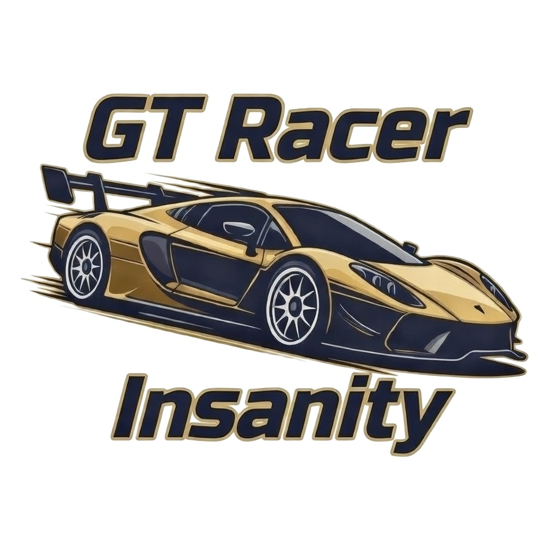

# GT Racer Insanity

[](https://codecov.io/gh/ragaeeb/gt-racer-insanity)
[](https://github.com/ragaeeb/gt-racer-insanity/actions/workflows/ci.yml)
[](https://github.com/ragaeeb/gt-racer-insanity/actions/workflows/release.yml)
[](https://bun.sh/)
[](https://www.typescriptlang.org/)
[](https://vitejs.dev/)
[](https://react.dev/)
[](https://threejs.org/)
[](https://docs.pmnd.rs/react-three-fiber)
[](https://socket.io/)
[](https://playwright.dev/)
[](https://opensource.org/licenses/MIT)
[](https://wakatime.com/badge/user/a0b906ce-b8e7-4463-8bce-383238df6d4b/project/77bad006-7cd7-47f4-a8d7-5a1d9d228e06)



Multiplayer racing game with a server-authoritative V2 simulation stack, finite race flow, and data-driven gameplay manifests.

## Latest Features
- V2-only realtime transport (`join_room`, `input_frame`, `ability_activate`, `restart_race`, `server_snapshot`, `race_event`) with sequenced input acknowledgements.
- Authoritative server simulation with Rapier rigid bodies for collision bumping, track boundary enforcement, and non-overlap guarantees.
- Late join now receives a fresh authoritative snapshot so active player positions are correct on entry.
- Finite full-race track flow with lap/checkpoint progression and a race-end barrier.
- Race results overlay with winner/position/lap summary plus restart flow.
- Authoritative status-effect pipeline for abilities, hazards, and power-ups (boosted, flat tire, stunned, slowed).
- Turbo power-ups and road-spike hazards with server-side collision and HUD toasts; scenery (city/canyon) and track-boundary regression tests.
- Expanded shared data manifests and validators for vehicles, abilities, effects, hazards, powerups, and tracks; snapshot payloads validate powerup/hazard item shapes.
- Player name prompt on join, with in-world name tags above every car.
- Multi-car catalog rotation by player ID (not only color differences).
- Sunny day and canyon-dusk environment profiles (`sceneEnvironmentProfiles`) for level/theme swaps; scenery rebuilds on track change.
- HUD includes speed, lap, position, effect badges (boosted/flat tire/stunned/slowed), and a queued toast pipeline.
- Layered car audio: idle engine, acceleration, driving loop, brake one-shot; audio fades out when the race finishes (dt-based).
- Better car graphics: wheels rotate with speed, brake-light emissives pulse while braking, and suspension subtly bounces as speed changes.
- Deterministic scenery builds alongside tracks via `SceneryManager`, with instanced buildings, street lights, and hazards that depend on track themes.
- Diagnostic instrumentation (`useDiagnostics`) exposes `__GT_DEBUG__`/`__GT_DIAG__`, toggleable via `?diag=1` or localStorage `gt-diag`, so we can capture long-task/frame-gap data during freeze investigations.
- E2E coverage includes smoke plus multiplayer non-overlap scenarios (run via `bun run e2e` after `bun x playwright install chromium`).

## Tech Stack
- `bun` runtime and package manager
- `React + Vite + @react-three/fiber + three` for the client runtime
- Rapier physics (`@dimforge/rapier3d-compat`) on the authoritative server simulation
- `zustand` for runtime/HUD state
- `Socket.IO + @socket.io/bun-engine` for realtime server communication
- `Tailwind CSS` + shadcn-style component patterns for app UI
- `TypeScript` with `ESNext` target
- `bun:test` for unit tests

## Quick Start
```bash
bun install
bun run server
bun run dev
```

Client:
- [http://localhost:3000](http://localhost:3000)

Server health:
- [http://localhost:3001/health](http://localhost:3001/health)

## Scripts
- `bun run dev` -> start Vite dev client
- `bun run server` -> start Bun Socket.IO server
- `bun run test` -> run all deterministic/unit tests (browser suites run via `bun run e2e`)
- `bun run test:watch` -> run tests in watch mode
- `bun run test:e2e:install` -> `bun x playwright install chromium`
- `bun run e2e` -> run all browser tests in `testing/` (smoke + multiplayer collision)
- `bun run build` -> typecheck and production build
- `bun run check` -> run tests then build

## Architecture
- `src/client/app`: app shell, routes, HUD overlays, lobby/startup flows.
- `src/client/game`: R3F runtime, entity controllers, finite track renderer, scene systems, camera loop.
- `src/client/game/state`: Zustand stores for runtime and HUD state.
- `src/client/game/systems`: interpolation/reconciliation/prediction helpers and gameplay adapters.
- `src/client/network`: Socket.IO V2 transport with sequenced `input_frame` and snapshot/race-event listeners.
- `src/server`: Socket.IO server, room lifecycle, authoritative simulation tick/snapshot broadcast.
- `src/server/sim`: authoritative simulation modules (Rapier world, colliders, input queue, race progression, effect/ability systems).
- `src/shared`: protocol contracts, manifests, deterministic logic and validators used by client/server.
- `testing`: opt-in browser E2E suites, gated from default `bun test`.

## Project Structure
```text
src/
  client/
    app/
    game/          # R3F runtime, entities, hooks, state, systems (TrackManager, SceneryManager, correction)
    network/
  components/
  lib/
  server/
    sim/           # Authoritative simulation (Rapier, colliders, input queue, effects, powerups, hazards)
  shared/
    game/          # Manifests, validators, car physics, track/effects/ability/powerup/hazard
    network/       # Protocol types, snapshot validators, input frame
    physics/       # Shared constants (e.g. player collider half-width)
testing/
public/
  branding/
  models/
```

## Testing Strategy
Logic that can be deterministic is extracted into shared/server modules and covered by `bun:test`:
- car motion physics, status-effect scaling, and race progression helpers
- client-side and server-side track boundary enforcement (regression tests)
- correction system (reconciliation alpha, hard snap, convergence)
- powerup and hazard collision and trigger behavior
- seeded PRNG, player color/vehicle hashing
- room state lifecycle + simulation queue/tick behavior
- protocol V2 payload and snapshot validators (including powerup/hazard item shapes)
- manifest schema validation

E2E tests:
- live in `testing/*.e2e.ts` and run via Playwright (`bun run e2e` after `bun x playwright install chromium`)
- Exercise load/connect/spawn/move/no-runtime-errors and multiplayer separation/diagnostics behavior

## Current Status
- V2-only netcode cutover is active; legacy `update_state`/`player_moved` runtime paths are removed.
- Server-authoritative collision bumping and finite race completion are enabled in the default multiplayer flow.
- Remaining roadmap work is focused on content depth, polish, and long-horizon scaling hardening.

## Lessons Learned
- Instrumentation pays off; `useDiagnostics` now exposes `__GT_DEBUG__`/`__GT_DIAG__`, which can be enabled through `?diag=1` or `localStorage gt-diag=true` to gather frame-gap and long-task data during collisions.
- The latest regression coverage (unit tests for interpolation, log-freezing detection, and the aggressive multiplayer E2E so we can catch freezes early) gives a quick safety net before landing tweaks to the simulation loop.
- HUD toasts, effect badges, and consistent `hudStore` actions keep visual feedback in sync when new powerups or hazards are introduced, so hook them in whenever a new effect is added.

## Car Models
- Multiplayer cars now cycle by player ID across multiple models.
- Models are sourced from Poly Pizza (Quaternius pack), all `CC0 1.0`:
  - [Car](https://poly.pizza/m/Cz6yDaUcM9)
  - [Sports Car](https://poly.pizza/m/OyqKvX9xNh)
  - [Pickup Truck](https://poly.pizza/m/qn4grQgHm8)
  - [SUV](https://poly.pizza/m/xsMtZhBkxL)
  - [Police Car](https://poly.pizza/m/BwwnUrWGmV)

## Audio Assets
- Driving loop (`/public/driving-loop.wav`): [Racing Car Engine Sound Loops](https://opengameart.org/content/racing-car-engine-sound-loops), license `CC0`.
- Brake sound (`/public/brake.mp3`): [10_hand brake.wav](https://freesound.org/s/498218/), license `CC0`.

## Versioning
Semantic versioning is automated by GitHub Actions:
- commit using Conventional Commits (`feat:`, `fix:`, `feat!:` / `BREAKING CHANGE:`)
- `semantic-release` computes `major`/`minor`/`patch`
- `CHANGELOG.md`, `package.json`, GitHub release, and `vX.Y.Z` tags are generated automatically on `main`

## License
This project is licensed under the MIT License. See [LICENSE.md](LICENSE.md).

## Author
- Ragaeeb Haq
- [github.com/ragaeeb](https://github.com/ragaeeb)
